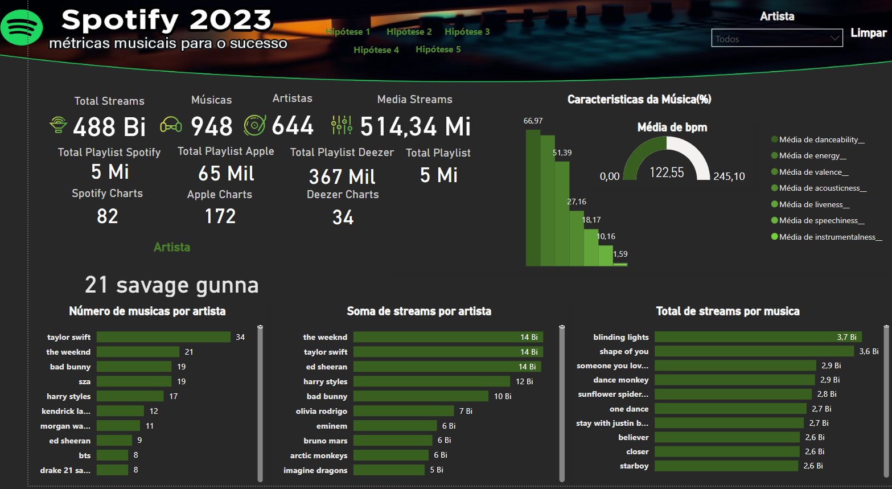

# 🎶 Hipóteses - Spotify 🎶

### **Tabela de conteudos**
- [🎶 Hipótese - Spotify 🎶](#-segmentacao-mercado)    
  - [**Introdução**](#introdução)
  - [**Objetivo**](#objetivo)
  - [**Equipe**](#equipe)
  - [**Ficha Técnica**](#ficha-tecnica)
  - [**Fontes de dados**](#fonte-de-dados)
  - [**Ferramentas e Tecnologias**](#ferramentas-e-tecnologias)
  - [**Processamento e análises**](#rocessamento-e-análises)
  - [**Resultados e Conclusões**](#Resultados-e-Conclusões) 
  - [**Google Sheets Dashboard**](#google-sheets-dashboard)
  -[**Referências:**](#referências)
   

---

## 📖 **Introdução**

Num mundo onde a indústria musical é extremamente competitiva e em constante evolução, a capacidade de tomar decisões baseadas em dados tornou-se um ativo inestimável.

Neste contexto, uma gravadora enfrenta o emocionante desafio de **lançar um novo artista** no cenário musical global. Felizmente, ela tem uma ferramenta poderosa em seu arsenal: um extenso conjunto de dados do Spotify com informações sobre as **músicas mais ouvidas em 2023**.

Com base nas hipóteses desenvolvidas pela gravadora, será validado ou refutado através da análise de dados e fornecer recomendações estratégicas com base nas descobertas. 

---

## 🎯 **Objetivo**

Explorar a analise dos dados, destacando como isso ajuda a melhorar a compreensão dos fenômenos, apoiar pesquisas e tomar decisões acertadas.

A gravadora levantou uma série de hipóteses sobre o que faz uma música seja mais ouvida. Essas hipóteses incluem:

- **Hipótese 1:** Músicas com BPM (Batidas Por Minuto) mais altos fazem mais sucesso em termos de número de streams no Spotify.
- **Hipótese 2:** As músicas mais populares no ranking do Spotify também possuem um comportamento semelhante em outras plataformas, como a Deezer.
- **Hipótese 3:** A presença de uma música em um maior número de playlists está correlacionada com um maior número de streams.
- **Hipótese 4:** Artistas com um maior número de músicas no Spotify têm mais streams.
- **Hipótese 5:** As características da música influenciam o sucesso em termos de número de streams no Spotify.

O objetivo principal desta análise é que a **gravadora e o novo artista possam tomar decisões que aumentem suas chances de alcançar o sucesso**.

---

## 🤝 **Equipe**

 - Marianela Ruiz e Thaise Oliveira.
---

## 📰 **Ficha Técnica**

 - https://unruly-whale-fb1.notion.site/P2-Hip-teses-Spotify-13a035f6e34a41419e22860516aa2588
---

## 🔧 **Ferramentas e Tecnologias** 
- Ferramentas: BigQuery, Google Colab.
- Linguagens: SQL e Python.
- Ferramentas de visualização : Power BI.

---

## 📈 **Fontes de dados**
- Principal fonte de dados: https://drive.google.com/drive/folders/1HJXQ14woPBi5YhKOiP1mkXgMl6L8lfLs?usp=sharing
- Manipulação de dados e testes estatísticos em Python(Google Colab): https://colab.research.google.com/drive/1yqDrSCxV1pLNdZte-QVcOxdOQywfsb8J?usp=sharing

---

## 🔎 **Processamento e análises**
Várias etapas foram seguidas para preparar os dados para análise:

- Eliminação de valores nulos para manter a qualidade, a precisão e a confiabilidade da análise, permitindo resultados mais robustos e acionáveis.
- Verificação e remoção de valores duplicados. É necessário investigar e corrigir valores de dados duplicados para manter a integridade dos dados.
- Decidiu-se remover a coluna 'in_shazam_charts' porque é um aplicativo que identifica músicas e foi considerado fora do escopo da análise.
- Decidiu-se remover as colunas 'key' e 'mode' porque elas têm muitos registros com valores nulos e consideramos que elas não fornecem muitas informações relevantes para a análise do estudo.
- Variáveis como 'data_de_lancamento', 'total_participation_inn_playlist', 'count_songs' foram criadas para melhorar a compreensibilidade e a utilidade dos dados. 
- Caracteres especiais foram identificados nas variáveis "track_name" e "artist_name" para melhorar a qualidade e a utilidade dos dados e, assim, melhorar a precisão e a eficiência da análise.
- Para as variáveis que descrevem as características das músicas, elas foram categorizadas em: baixa e alta, para que fosse possível aplicar testes estatísticos.
- Salvamos os dados limpos em um novo arquivo pronto para a análise descritiva, inferencial e de regressão linear.
Seguindo essas etapas, conseguimos garantir que nossos dados fossem confiáveis e bem preparados para análise.

---

## 💡 **Resultados e Conclusões**

A partir da análise realizada neste projeto, usando análise exploratória, testes estatísticos e regressão linear, analisei as características das músicas mais ouvidas no Spotify durante o ano de 2023. Uma série de hipóteses propostas pela gravadora foi validada para identificar as tendências que contribuem para o sucesso de uma música, com o objetivo de lançar um novo artista de acordo com as características do mercado.

### Hipótese 1: Músicas com BPM (Batidas Por Minuto) mais altos fazem mais sucesso em termos de streams no Spotify
- Os resultados obtidos indicam uma ausência de correlação significativa, o valor da correlação de Pearson é:-0,0033105926438257737, muito próximo de 0, indicando que praticamente não há relação linear entre o BPM de uma música e o número de stremas que ela recebe. Essa baixa correlação sugere que o BPM não é um fator determinante no sucesso de uma música, medido pelo número de transmissões.

- As variáveis do estudo não seguem uma distribuição normal, por isso optamos por aplicar o teste U de Mann-Whitney, um teste não paramétrico que compara as distribuições de dois grupos independentes. Nesse caso, ele foi usado para comparar músicas com diferentes faixas de BPM. Foi obtido um valor p de 0,6299027679552872 maior que o nível de significância (0,05), indicando que não há evidência suficiente para rejeitar a hipótese nula, o que significa que não há diferenças significativas no número de transmissões entre músicas com diferentes BPM. Esses resultados sugerem que outros fatores além do BPM podem ser mais importantes para determinar o sucesso de uma música, já que a popularidade do artista, a promoção, o gênero, a letra e outros aspectos da produção musical podem ter um impacto maior.
 
 - Em resumo, BPM não é um indicador significativo do sucesso de uma música em termos de streams no Spotify. **Hipótese Rejeitada**.

 ### Hipótese 2: As músicas mais populares no ranking do Spotify também possuem um comportamento semelhante em outras plataformas como Deezer e Apple.

#### **Spotify charts e Deezer Charts**

- A correlação de Spearman é uma medida não paramétrica que avalia a relação monotônica entre duas variáveis ordinais. O valor da correlação das variáveis foi: 0,5900663658867531, indicando uma correlação positiva moderada entre as posições nos rankings do Spotify e da Deezer. Isso sugere que as músicas que são populares no Spotify também tendem a ser populares no Deezer, embora não perfeitamente.

- Um valor de p-value: 5.309451108676141e-90 baixo(muito inferior a 0,05), indica que a correlação observada é altamente significativa do ponto de vista estatístico. Isso significa que é extremamente improvável que a correlação observada se deva ao acaso, reforçando a validade da correlação positiva moderada observada.

- Há uma correlação moderada significativa: a correlação de Spearman de 0,5900663658867531, combinada com um valor de p extremamente baixo, sugere que há uma relação estatisticamente significativa entre o sucesso das músicas no Spotify e na Deezer.

- Em resumo, a hipótese de que as músicas populares no Spotify também são populares na Deezer está parcialmente confirmada. A correlação moderada sugere que há uma tendência significativa, embora não perfeita, de que as músicas que fazem sucesso em uma plataforma façam sucesso na outra. 

#### **Spotify charts e Apple Charts**

- A correlação de Spearman é uma medida não paramétrica que avalia a relação monotônica entre duas variáveis ordinais. O valor da correlação das variáveis foi: 0.520808671061685, esse valor indica uma correlação positiva moderada entre as posições das músicas nos rankings do Spotify e do Apple Music, embora não seja perfeita.

- Um valor de p-value: 4,9887224722760026e-67 baixo(muito menor que 0,05), indica que a correlação observada é altamente significativa.

- Em resumo, a hipótese de que as músicas populares no Spotify também são populares na Apple está parcialmente confirmada. A correlação moderada sugere que há uma tendência significativa, embora não perfeita, de que as músicas que fazem sucesso em uma plataforma façam sucesso na outra. 

### Hipótese 3: A presença de uma música em um maior número de playlists está relacionada com um maior número de streams.

Os resultados obtidos para a hipótese 3 são bastante reveladores e sugerem uma forte relação entre a presença de uma música nas listas de reprodução e seu número de streams.

- Forte correlação significativa: a alta correlação de Pearson (0,7835372823802433), juntamente com o valor de p extremamente baixo (1,7265274903806566e-247), indica uma relação forte e significativa entre a presença em listas de reprodução e o número de streams.
- Regressão linear útil, mas não exaustiva: o R² de 0,53 sugere que, embora o número de playlists em que uma música aparece seja um importante indicador do número de streams, outros fatores também desempenham um papel significativo.
- Em resumo, as variáveis mostram uma relação forte e significativa entre a presença de uma música nas listas de reprodução e o número de streams que ela recebe de acordo com a forte correlação de Pearson. Entretanto, como o R² é de 0,53, também é importante considerar outros fatores que podem influenciar o número de streams.**Hipótese parcialmente confirmada**.

### Hipótese 4: Artistas com maior número de músicas no Spotify têm mais streams.

Os resultados da hipótese 4 são bastante claros e sugerem uma relação significativa entre o número de músicas que um artista tem no Spotify e o número total de streams que ele recebe.

- Forte correlação significativa: a alta correlação de Pearson (0,7789441982622838), juntamente com o valor de p-value(4.2222214971206745e-33) extremamente baixo, indica uma relação forte e significativa entre o número total de músicas e o número total de streams.

- Regressão linear explicativa: o R² de 0,70 sugere que o número total de músicas de um artista é um indicador significativo do número total de fluxos, embora ainda haja 30% da variabilidade que pode ser explicada por outros fatores.

- Em resumo, a análise mostra uma relação forte e significativa entre o número total de músicas de um artista no Spotify e o número total de streams que ele recebe. A forte correlação de Pearson e o R² significativo da regressão linear sugerem que ter um número maior de músicas é um fator de sucesso em termos de streams. Embora o número total de músicas explique grande parte da variabilidade dos streams (70%), também é importante considerar outros fatores que podem influenciar o sucesso de um artista, como a popularidade de cada música, as colaborações com outros artistas e as estratégias de marketing.**Hipótese parcialmente confirmada**.

### Hipótese 5: As características da música influenciam o sucesso em termos de streams no Spotify.

- Correlações fracas: todos os coeficientes de correlação estão próximos de 0, uma relação muito fraca, indicando que não há relação significativa entre as características musicais analisadas e o número de streams.

- Teste de Significância: Optamos por realizar o teste U de Mann-Whitney para entender se havia um comportamento diferente entre os grupos e o número de streams das canções. Apenas a variável "danceability" apresentou uma pequena diferença significativa entre suas categorias e o número de streams. Isso indica quão apropriada é a canção para dançar e se tem alguma influência no número de streams, mas as outras características não demonstraram uma diferença significativa.

- Considerando os resultados dos testes estatísticos, optou-se por refutar a hipótese de que as características das músicas influenciam o sucesso em termos de número de streams no Spotify. Embora algumas características, como "danceability", pareçam ter impacto, outras não demonstraram uma associação clara com o número de streams.**Hipótese refutada**.

💡 **Recomendações** 💡

Com base nos resultados das hipóteses analisadas, apresentamos aqui uma série de recomendações e estratégias que a gravadora e o novo artista podem seguir para aumentar suas chances de obter sucesso.

1. incluir músicas em listas de reprodução
  - Estratégia: Esforce-se para incluir músicas no maior número possível de listas de reprodução, especialmente nas listas de reprodução populares selecionadas pelo Spotify.
  - Ação: Entre em contato e colabore com influenciadores para colocar a música nas listas de reprodução deles.

2. Expansão do catálogo de músicas
  - Estratégia: Incentive o artista a lançar mais músicas regularmente para aumentar sua presença na plataforma.
  - Ação: Planejar lançamentos frequentes e manter um fluxo constante de novas músicas para manter os ouvintes interessados e aumentar as chances de serem descobertos.

3. Promoção em várias plataformas de streaming
  - Estratégia: Não se concentre exclusivamente no Spotify, mas também promova músicas em outras plataformas de streaming, como Deezer e Apple Music.
  - Ação: otimize os perfis em todas as plataformas, realize campanhas promocionais e busque a inclusão em listas de reprodução em cada serviço.

4. Colaborações estratégicas
  - Estratégia: Colaborar com artistas que já tenham uma base de ouvintes significativa.
  - Ação: Buscar oportunidades de colaborações com artistas de gêneros semelhantes ou complementares para atrair seus seguidores.

5. Explorar fatores extramusicais
  - Estratégia: Concentrar esforços em fatores extramusicais que influenciam o sucesso.
  - Ação: Investir em marketing digital, mídia social, vídeos musicais envolventes e colaborações com outros artistas populares para aumentar a visibilidade e atrair mais ouvintes.

6. Use dados e análises
  - Evidência: A análise de dados pode fornecer informações valiosas sobre o que está funcionando e o que não está.
  - Estratégia: Implemente um sistema de monitoramento contínuo das métricas de desempenho das músicas.
  - Ação: Use as ferramentas de análise do Spotify for Artists, bem como serviços de terceiros, para obter dados detalhados sobre os ouvintes, sua localização e hábitos de escuta. Ajuste as estratégias de marketing e promoção de acordo.

Para que a gravadora e o novo artista aumentem suas chances de sucesso, eles devem se concentrar em maximizar a presença de suas músicas nas listas de reprodução, expandir seu catálogo de músicas, promover suas músicas em várias plataformas e usar estratégias robustas de marketing digital. Além disso, eles devem aproveitar a análise de dados para tomar decisões informadas e explorar colaborações estratégicas para aumentar sua visibilidade. Além disso, as redes sociais de um artista, especialmente Instagram, YouTube, Tik Tok, Twitter e agora também Twitch, são ferramentas muito importantes para promover a música. Essas ações combinadas podem aumentar significativamente suas chances de alcançar um número maior de streams.
---
## 📊 **Painel de controle (dashboard) no Power BI**

---

## **Referências**

- https://repositorio.uac.pt/bitstream/10400.3/5365/1/Sousa_CA_21%20Mar%C3%A7o%202019.pdf
- https://cienciadedatos.net/documentos/py10-regresion-lineal-python
- https://www.lacupulamusic.com/blog/que-mide-el-exito-de-un-artista-en-la-industria-musical-actual/